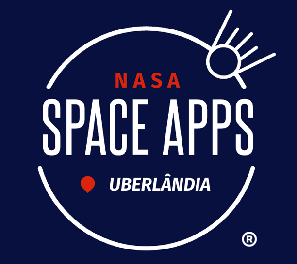

# 🚀 NASA Space Apps Matchmaking API

<p align="center">
  
</p>

<p align="center">
  API de autenticação e matchmaking para o NASA Space Apps Challenge Uberlândia
</p>

<p align="center">
  <a href="https://nestjs.com/" target="_blank"></a>
  <a href="https://www.typescriptlang.org/" target="_blank"></a>
  <a href="https://nodejs.org/" target="_blank"></a>
</p>

## 📋 Descrição

Sistema de autenticação por email com código de 6 dígitos para participantes registrados no NASA Space Apps Challenge Uberlândia. A API verifica se o email está cadastrado nas planilhas oficiais do evento e envia um código temporário para autenticação segura.

## ✨ Funcionalidades

- 🔍 **Verificação de Email**: Consulta planilhas do Google Sheets para validar registros
- 📧 **Envio de Código**: Geração e envio automático de código de 6 dígitos por email
- 🔐 **Autenticação Segura**: Códigos temporários com expiração de 15 minutos
- 📊 **Logs Estruturados**: Sistema completo de logging para monitoramento
- 🏗️ **Arquitetura Hexagonal**: Clean Architecture com separação clara de responsabilidades

## 🛠️ Tecnologias

- **Framework**: NestJS
- **Linguagem**: TypeScript
- **Validação**: class-validator + class-transformer
- **Email**: Nodemailer
- **Integração**: Google Sheets API
- **Arquitetura**: Hexagonal (Ports & Adapters)

## 📁 Estrutura do Projeto

```
src/
├── controllers/           # 🎮 Controllers HTTP
│   ├── registration.controller.ts
│   └── controllers.module.ts
├── services/              # 🔧 Lógica de negócio
│   ├── auth.service.ts
│   ├── email.service.ts
│   ├── user.service.ts
│   ├── registration.service.ts
│   └── services.module.ts
├── dtos/                  # 📝 Data Transfer Objects
│   └── registration.dto.ts
├── domain/                # 🏛️ Entidades de domínio
│   ├── entities/
│   │   ├── user.entity.ts
│   │   └── auth-code.entity.ts
│   └── value-objects/
│       ├── email.vo.ts
│       └── auth-code.vo.ts
├── application/           # 🔌 Interfaces/Contratos
│   └── ports/
├── infrastructure/        # 🏗️ Implementações técnicas
│   ├── adapters/
│   └── infrastructure.module.ts
├── app.module.ts          # 🌟 Módulo principal
└── main.ts               # 🚀 Entry point
```

## 🔧 Configuração

### 1. Instalação

```bash
# Instalar dependências
npm install
```

### 2. Configuração do Ambiente

Crie um arquivo `.env` baseado no `.env.example`:

```env
# Google Sheets API
GOOGLE_SERVICE_ACCOUNT_KEY_FILE=path/to/your/service-account-key.json

# Email Configuration (SMTP)
SMTP_HOST=smtp.gmail.com
SMTP_PORT=587
SMTP_USER=your-email@gmail.com
SMTP_PASS=your-app-password
SMTP_FROM=your-email@gmail.com
```

### 3. Configuração do Google Sheets API

1. Acesse o [Google Cloud Console](https://console.cloud.google.com/)
2. Crie um projeto ou use um existente
3. Habilite a Google Sheets API
4. Crie uma conta de serviço
5. Baixe o arquivo JSON de credenciais
6. Configure o caminho no arquivo `.env`

## 🚀 Execução

```bash
# Desenvolvimento
npm run start:dev

# Produção
npm run start:prod

# Build
npm run build
```

## 📚 Endpoints da API

### 🔍 Verificar Email
**GET** `/registration/check-email?email=exemplo@email.com`

Verifica se o email está registrado e envia código de autenticação.

**Resposta de sucesso (email registrado):**
```json
{
  "email": "exemplo@email.com",
  "isRegistered": true,
  "message": "Código de autenticação enviado para seu email",
  "emailSent": true
}
```

**Resposta (email não registrado):**
```json
{
  "email": "exemplo@email.com", 
  "isRegistered": false,
  "message": "Email não está registrado no NASA Space Apps Uberlândia"
}
```

### 🔐 Verificar Código
**POST** `/registration/verify-code`

```json
{
  "email": "exemplo@email.com",
  "code": "123456"
}
```

**Resposta de sucesso:**
```json
{
  "email": "exemplo@email.com",
  "authenticated": true,
  "message": "Login realizado com sucesso",
  "registrationInfo": {
    "id": "exemplo@email.com",
    "fullName": "João Silva",
    "email": "exemplo@email.com",
    "phone": "(34) 99999-9999",
    "city": "Uberlândia",
    "educationLevel": "Superior incompleto",
    "participationMode": "Presencial"
  }
}
```

### 📋 Obter Informações do Usuário
**GET** `/registration/info?email=exemplo@email.com`

Retorna informações completas do registro do usuário.

## 🔒 Segurança

- ✅ Códigos de autenticação expiram em 15 minutos
- ✅ Códigos só podem ser usados uma vez
- ✅ Validação rigorosa de email
- ✅ Logs de segurança para auditoria
- ✅ Limpeza automática de códigos expirados

## 📧 Template de Email

O sistema envia emails profissionais com:
- Logo oficial do NASA Space Apps Uberlândia
- Design responsivo com cores da NASA
- Código destacado visualmente
- Instruções claras de uso
- Aviso de expiração

## 🧪 Testes

```bash
# Testes unitários
npm run test

# Testes e2e
npm run test:e2e

# Coverage
npm run test:cov
```

## 📊 Logs e Monitoramento

Sistema completo de logging com:
- Níveis: INFO, WARN, ERROR, DEBUG
- Contexto por serviço
- Timestamps precisos
- Metadados estruturados
- Stack traces detalhados

## 🏗️ Arquitetura

### Princípios Seguidos
- **Clean Architecture**: Dependências apontam para dentro
- **SOLID**: Princípios de design orientado a objetos
- **Hexagonal**: Portas e adaptadores
- **DDD**: Domain-Driven Design
- **Inversion of Control**: Injeção de dependência

### Camadas
1. **Domain**: Regras de negócio puras
2. **Application**: Casos de uso e contratos
3. **Infrastructure**: Detalhes técnicos
4. **Presentation**: Controllers HTTP

## 🤝 Contribuição

1. Fork o projeto
2. Crie uma branch para sua feature (`git checkout -b feature/AmazingFeature`)
3. Commit suas mudanças (`git commit -m 'Add some AmazingFeature'`)
4. Push para a branch (`git push origin feature/AmazingFeature`)
5. Abra um Pull Request

## 📄 Licença

Este projeto está sob a licença MIT. Veja o arquivo [LICENSE](LICENSE) para detalhes.

## 🌟 NASA Space Apps Challenge

Este projeto faz parte do **NASA Space Apps Challenge Uberlândia**, um hackathon global que conecta equipes para resolver desafios reais da NASA usando dados abertos.

- 🌐 [Site Oficial](https://www.spaceappschallenge.org/)
- 📍 **Local**: Uberlândia, Minas Gerais, Brasil
- 🎯 **Objetivo**: Facilitar o matchmaking entre participantes

---

<p align="center">
  Desenvolvido com ❤️ para o NASA Space Apps Challenge Uberlândia 2025
</p>